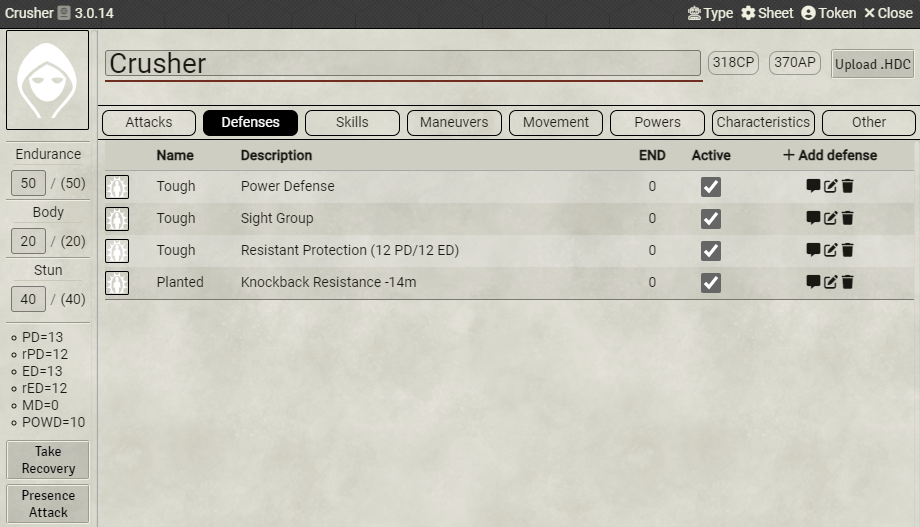
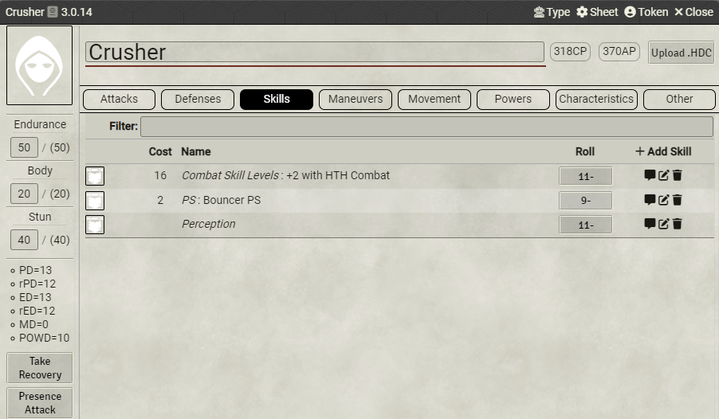
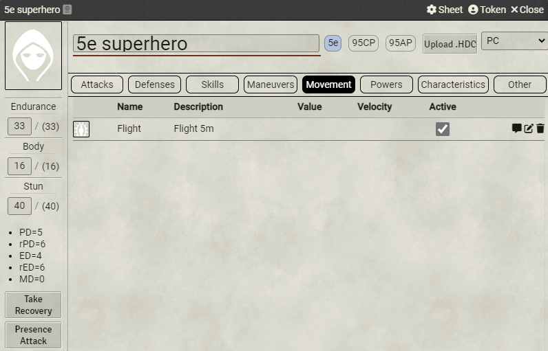
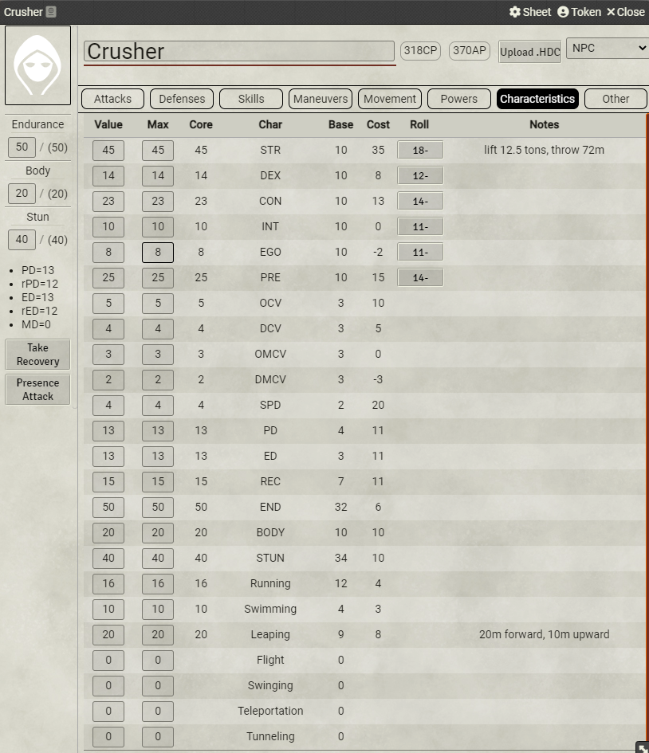
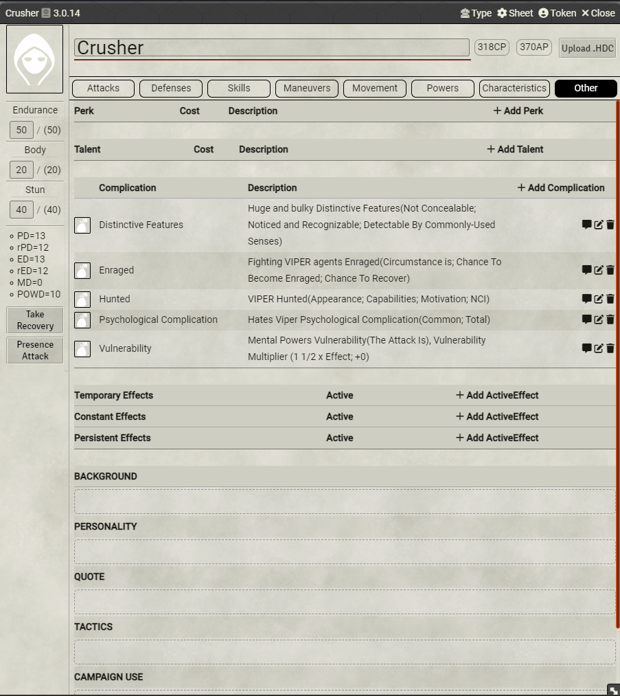
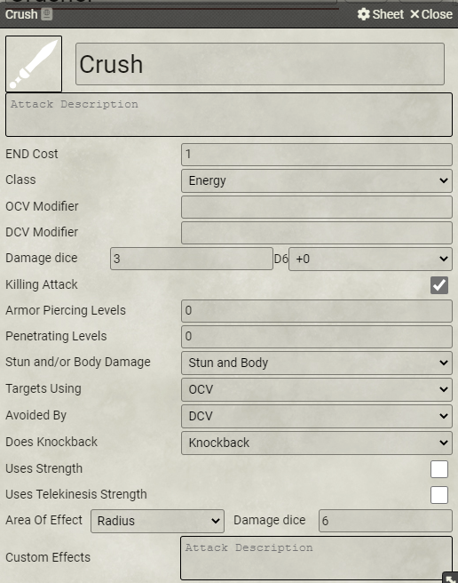
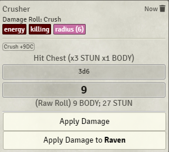
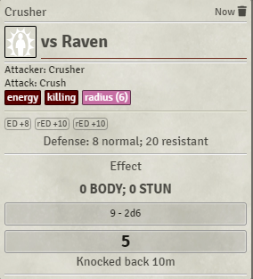

# Hero System 6e (Unofficial) v2

Forked from Hero System 6e (Unofficial)

This system is for playing the sixth edition of the Hero System using FoundryVTT.

HERO SystemTM ® is DOJ, Inc.'s trademark for its roleplaying system.
HERO System Copyright © 1984, 1989, 2002, 2009 by DOJ, Inc. d/b/a Hero Games. All rights
reserved.
Fantasy Hero © 2003, 2010 by DOJ, Inc. d/b/a Hero Games. All rights reserved.
Star Hero © 2003, 2011 by DOJ, Inc. d/b/a Hero Games. All rights reserved.
All DOJ trademarks and copyrights used with permission.
For further information about Hero Games and the HERO System, visit www.herogames.com.

## Functionality

This system is a work in progress. The following features are supported

* A proper Turn/Phase/Segment initiative tracking system
* A character sheet that you can upload a .HDC file to
* Attack automation
* The ruler tool will show the default range modifier for the distance drawn

### Character Sheet

- The character sheet in this system supports automation for characteristic and skill rolls.
- .HDC files created in the Hero Designer can be uploaded to it, and currently supports automatically populating information for a character's characteristics and skills.
- Most attack powers are copied from powers to attacks tab.  Most defense powers are copied from powers to defenses tab.
- Attacks and defense can be manually added by users.
- Defenses can be toggled on and off.
- The character sheet can be used to take a Recovery.
- Character image stored in .HDC file is used for token.

#### Maneuvers

Activating a maneuver from a character sheet will apply OCV and DCV modifiers with the exception of variable modifiers or modifiers that take speed into account. Only one maneuver can be selected at a time with the exception of 'Set' and 'Brace'.

### Attack Automation

- An attack can be used by clicking on the attack's image from the Character Sheet 'Attacks' tab. This will add a card to the chat for the attack.
- The card will show the attack roll and damage roll as well as any additional effects information below.
- Target defense can be applied to damage rolls.  Final damage is applied to token's stun/body.  If Stun damage exceeds CON then a stunned condition is applied.
- You can drag attack from character sheet to quick bar.

## System Options

- Use Stunned : whether or not attacks can inflict stunned
- Use Endurance : whether or not endurance will be automatically tracked when using automated attack cards
- Use Knockback : automates knockback rolls and calculations from attack cards
- Hit Locations : automates hit location rolls and calculations from attack cards
- Hit Location (Track Damage Done to Individual Body Parts) : health tracking for individual body parts
- Optional Maneuvers : adds optional maneuvers to character sheets on .HDC upload
- Attack Card Automation:
    No Automation: attack card will show attack and damage results, but will not update body, stun, or end from target
    NPCs Only: attack card will subtract effective values from body, stun, and end but only for actors/tokens without a player owner
    PCs(end) and NPCs: same as NPCs only except actors/tokens with a player owner will update end
    PCs and NPCs: attack card will update stun, body, and end for all tokens/actors

## Known Limitations
- The upload of a .HDC file is practically a requirement.  You can't create powers, skills, or equipment from scratch.  Character editing is limited within the system.
- Power frameworks are largely ignored, powers within the framework should work.
- Endurance use of non-attacking powers is untracked.
- The following are largely not implemented
  - Adjustment powers (Absorption Aid, Drain, Healing).
  - Attack powers that do not do stun/body damage (Change Environment, Darkness, Dispel, Drain, Entangle, Flash, Images, Mental Illusions, Mind Control, Reflection, Transform).
  - Attack powers with NND
  - Automation powers(Cannot Be Stunned, Does Not Bleed, No Hit Locations, Takes No STUN).
  - Body-Affecting powers are not fully implemented (Desolidification, Duplication, Extra Limbs, Growth, Multiform, Shape Shift, Shrinking, Stretching)
  - Mental Powers (Mental Illusions, Mind Control, Mind Scan, Telepathy)
  - Sense-Affecting powers
  - Sensory powers
  - Special powers
  - Power limitations
  - Perks, Talents, and Complications

## Modules
The following modules have been successfully tested for compatibility
  - [Dice so nice!](https://gitlab.com/riccisi/foundryvtt-dice-so-nice)
  - [Simple Calendar](https://github.com/vigoren/foundryvtt-simple-calendar)

## 5th Edition Support
This is a 6E framework, however 5E is very similar to 6E and with a few minor changes you may be able to play a 5E game.  A 5E character is detected when you upload a HDC file using one of the 5E Hero Designer character templates.  The following 5E rules are supported:
- Figured Characteristics
  - PD, ED, SPD, REC, END, STUN, OCV/DCV, ECV (is still referred to as OMCV/DMCV).
- Killing Attack stun multiplier is 1d6-1 (minimum 1)

## Screenshots

