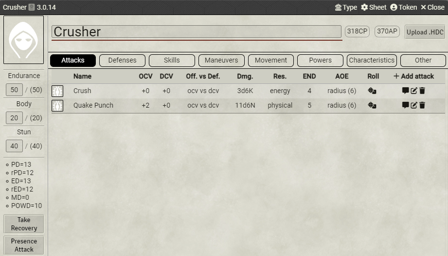
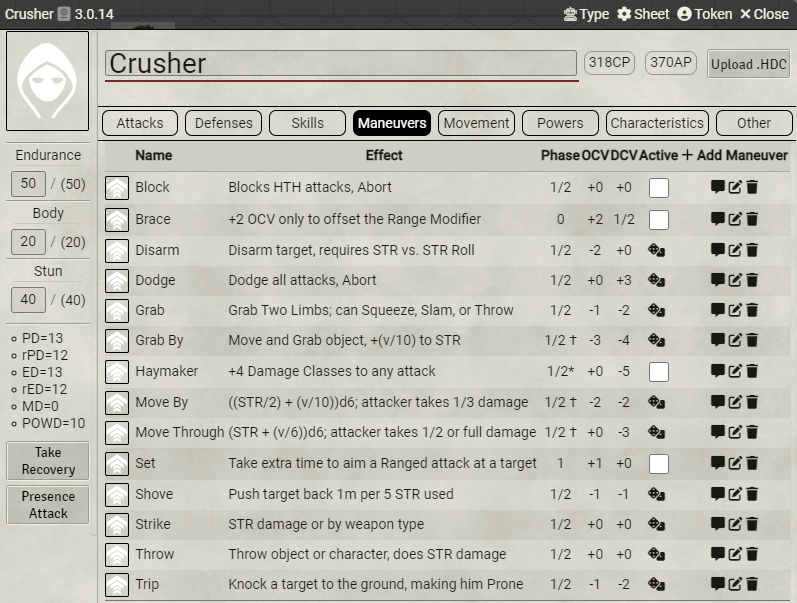
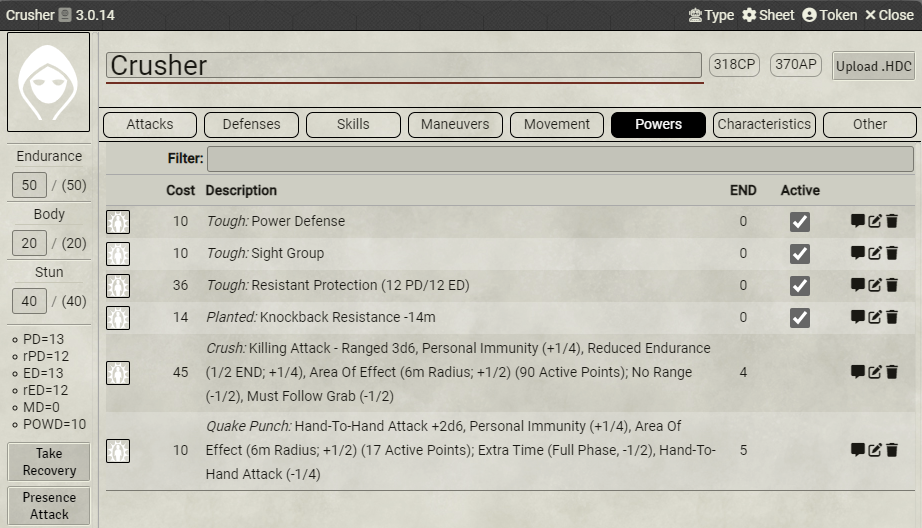
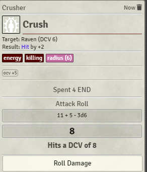
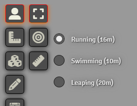

# Hero System 6e (Unofficial) v2

Forked from Hero System 6e (Unofficial)

This system is for playing the sixth edition of the Hero System using FoundryVTT.

HERO SystemTM ® is DOJ, Inc.'s trademark for its roleplaying system.
HERO System Copyright © 1984, 1989, 2002, 2009 by DOJ, Inc. d/b/a Hero Games. All rights
reserved.
Fantasy Hero © 2003, 2010 by DOJ, Inc. d/b/a Hero Games. All rights reserved.
Star Hero © 2003, 2011 by DOJ, Inc. d/b/a Hero Games. All rights reserved.
All DOJ trademarks and copyrights used with permission.
For further information about Hero Games and the HERO System, visit www.herogames.com.

Support can be found by creating a [new issue](https://github.com/dmdorman/hero6e-foundryvtt/issues), starting a [new discussion](https://github.com/dmdorman/hero6e-foundryvtt/discussions) or on the Hero-Champions-RPG (unofficial) Foundry-vtt [Discord Channal](https://discord.com/channels/609528652878839828/770825017729482772).

## Functionality

This system is a work in progress. The following features are supported

* A proper Turn/Phase/Segment initiative tracking system
* A character sheet that you can upload a .HDC file to
* Attack automation
* Support for [Drag Ruler](https://foundryvtt.com/packages/drag-ruler)

### Character Sheet

- The character sheet in this system supports automation for characteristic and skill rolls.
- .HDC files created in the Hero Designer can be uploaded to it, and currently supports automatically populating information for a character's characteristics, skills, powers, etc.
- Most attack powers are displayed in attacks tab.  Most defense powers are displayed in defenses tab.
- Attacks, defense, and skills can be manually added by users.
- Defenses and most powers can be toggled on and off.
- The character sheet can be used to take a Recovery.
- Character image stored in .HDC file is used for token.

#### Maneuvers

Custom maneuvers show under attacks.  Basic maneuvers are shown in the maneuver's tab.  The ones that are actions (and behave like an attack) have a roll icon and behave like an attack.  Set/Brace/Haymaker are toggles and enhance other attacks.

### Attack Automation

- An attack can be used by clicking on dice icon from the Character Sheet 'Attacks' tab. This will add a card to the chat for the attack.
- The card will show the attack roll and damage roll as well as any additional effects information below.
- Target defense can be applied to damage rolls.  Final damage is applied to token's stun/body.  If Stun damage exceeds CON then a stunned condition is applied.
- You can drag attacks (or any power) from character sheet to quick bar.

### Other Automation
- END and Charges are spent for each attack. 
- END can be spent from personal endurance or from an endurance reserve.
- Post Segment 12 recovery: Endurance and Stun
- END for active powers are spent each phase.
- Stun and attacks that have DCV modifications expire on next phase.
- Some status' have CV modifications.
- Powers that modify characteristics and defenses can be toggled on/off.
- Powers with Requires A Roll are automatically rolled.
- Charges recover each day (Simple Calendar required)
- END/STUN/BODY recover out of combat (Simple Calendar required)
- Stun/KnockedOut/Aborted prevent attacks or turning on powers.
- Combat Skill Levels are calculated.
- Knockback calculations.
- Aid/Drain/Transfer effects are calculated, they fade and eventually expire.
- Penetrating/Impenetrable and Armor Piercing/Hardened calculations.
- Drag Ruler (optional module) show color coded full/half moves.
- Velocity estimations for move by and move through based on current movement type.  Drag Ruler (optional module) improves velocity estimation.
- Range penalties included in calculations.

## System Options

- Use Stunned : whether or not attacks can inflict stunned
- Use Endurance : whether or not endurance will be automatically tracked when using automated attack cards
- Use Knockback : automates knockback rolls and calculations from attack cards
- Hit Locations : automates hit location rolls and calculations from attack cards
- Hit Location (Track Damage Done to Individual Body Parts) : health tracking for individual body parts
- Optional Maneuvers : adds optional maneuvers to character sheets on .HDC upload
- Attack Card Automation:
    No Automation: attack card will show attack and damage results, but will not update body, stun, or end from target
    NPCs Only: attack card will subtract effective values from body, stun, and end but only for actors/tokens without a player owner
    PCs(end) and NPCs: same as NPCs only except actors/tokens with a player owner will update end
    PCs and NPCs: attack card will update stun, body, and end for all tokens/actors

## Known Limitations
- The upload of a .HDC file from Hero Designer is practically a requirement.  You can't create powers, skills, or equipment from scratch.  Character editing is limited within the system.  Some power modifiers are supported, some are not, character sheets do not clearly show power modifiers.  You can click the chat icon next to a power to see the full description.
- Untested/limited support for vehicles, automations, computers, etc.
- Power frameworks are partially supported.
- The following are largely not implemented
  - Adjustment powers (Healing).
  - Attack powers that do not do stun/body damage (Change Environment, Darkness, Dispel, Drain, Entangle, Flash, Images, Mental Illusions, Mind Control, Reflection, Transform).
  - Attack powers with NND & AVAD
  - Automation powers (Cannot Be Stunned, Does Not Bleed, No Hit Locations, Takes No STUN).
  - Body-Affecting powers (Desolidification, Duplication, Extra Limbs, Growth, Multiform, Shape Shift, Shrinking, Stretching)
  - Mental Powers (Mental Illusions, Mind Control, Mind Scan, Telepathy)
  - Sense-Affecting powers (Darkness, Flash, Images, Invisibility)
  - Sensory powers (Clairsentience, Enhanced Senses, Mind Scan)
  - Special powers (Duplication, Endurance Reserve, Enhanced Senses, Extra Limbs, Flash Defense, Luck, Power Defense, Regeneration)
  - Perks, Talents, and Complications

## Modules
The following modules have been successfully tested for compatibility.  They are also recommended.
  - [Dice so nice!](https://gitlab.com/riccisi/foundryvtt-dice-so-nice)
  - [Simple Calendar](https://github.com/vigoren/foundryvtt-simple-calendar)
  - [Drag Ruler](https://foundryvtt.com/packages/drag-ruler)

## 5th Edition Support
This is a 6E framework, however 5E is very similar to 6E and with a few minor changes you may be able to play a 5E game.  A 5E character is detected when you upload a HDC file using one of the 5E Hero Designer character templates.

## Frequently Asked Questions and GM suggestions
1. The Actor Sheet doesn't match HD.
   - Try uploading the HDC file again.
2. How do you set a toggle power to default to off after HDC upload?
   - In HD set "Totaling Options" to "Do not add to Totals".
3. How do you get automation to destermine hit or miss?
   - Click the target of your attack.  Press 't' to select target.  Open attacker's character sheet.  Click dice icon next to attack.  The chat cards should show a hit/miss.  If it is a hit then the damage card will have a button to apply damage to your target.
   - You can select multiple targets with shift-t.
4. I'm unable to change a Characteristics Max number.
   - You likely have a power that is modifying the Max number.  Turn that power off, make the change to Max, then turn power back on.
5. Is there a way to change measuring distance to 1" for 5e campaigns?
   - You can change it scene by scene by opening the scene settings -> grid then edit 'Grid Scale'
6. Marking a token as dead marks all identical tokens as dead. [#247](https://github.com/dmdorman/hero6e-foundryvtt/issues/153)
   - You need to turn off *Link Actor Data* in the actor Prototype Token or Token screen.
   - Named actors can have tokens on several scenes, and by default their properies are linked to the master actor.  So as you move from scene to scene their STUN/BODY/Statuses and all other properties remain the same.
   - Generic actors should have their link actor data unchecked, which allows you to make distinct changes to the tokens, those changes do not affect the master actor.  There are also options on the Prototype token to add a number or adjetive to the token name.

## Screenshots

